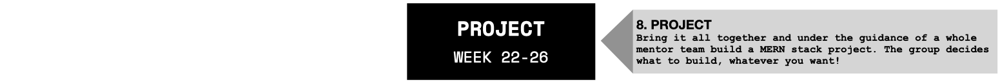

# Module #8 - Project: Build an application with a team (Full Stack)

Welcome to the Project module! Congratulations on making it this far!

In the upcoming 7 weeks you'll be immersed into the web developer life. By the end of it you will have created a full-stack web application and published it to the internet.

Everything you have learned so far will be combined and put into practice. Added to that you'll learn some more cutting-edge technologies that will prepare you for a great start in a modern software company. We will start out with the basics and incrementally add more complexity. This way you'll learn how all the pieces of a full-stack application fit together, thereby gaining a deeper understanding of where the backend stops and frontend starts.

Along with practicing your programming skills you will also be working on your communication skills. This is just as important, because you need to be able to communicate your ideas and efforts in an easy-to-understand manner.

Lastly, we'll tackle the subject of `software development methodology`. Or, in other words, the HOW of building software in teams. We'll take a look at the history and then dive into more modern forms of

## Learning Goals

During the Project you will work on your technical and communication skills. At the end of this module you'll learn the following:

Technical skills:

- How to `build a complete full-stack application`
- Understanding `how each part of an application relates` to each other
- What it means to work on a `feature`
- How to work with `GIT in a team setting`
- How to write `readable code`

Communication skills:

- `Keeping track` of your project's progress using GitHub Boards
- How to `communicate technically` about what you're doing
- Learning how to be `solutions-oriented`
- How to work in a `Agile setting`
- Learning about `Scrum` and its applications

## Project Outline

In the following table you'll see the outline for each week. Notice how you'll be working on both the technical and communication sides of the project.

| Week # | Topic                                  | Readings                        |
| ------ | -------------------------------------- | ------------------------------- |
| 1.     | Introducing Project, Build the backend | [Reading W1](./week1/README.md) |
| 2.     | Build the frontend                     | [Reading W2](./week2/README.md) |
| 3.     | Bring everything together              | [Reading W3](./week3/README.md) |
| 4.     | Presentation, Discuss Features         | [Reading W4](./week4/README.md) |
| 5.     | Group: Working on features I           | [Reading W5](./week5/README.md) |
| 6.     | Group: Working on features II          | [Reading W6](./week6/README.md) |
| 7.     | Final Presentation                     | [Reading W7](./week7/README.md) |

## Learn By Example! Previous Projects

There have been other classes before who have been through the same process.

Click on the following [link](.//documentation/projects/README.md) to see examples of their projects.

## After Project

Congratulations for finishing the Project module! You may call yourself a **worthy** junior web developer now. You are also now part of the HackYourFuture Alumni Network.

What now? Simple! Just go [here](./documentation/postgraduation.md).

_The HackYourFuture curriculum is subject to CC BY copyright. This means you can freely use our materials, but just make sure to give us credit for it :)_

 This work is licensed under a <a rel="license" href="http://creativecommons.org/licenses/by/4.0/">Creative Commons Attribution 4.0 International License</a>.
