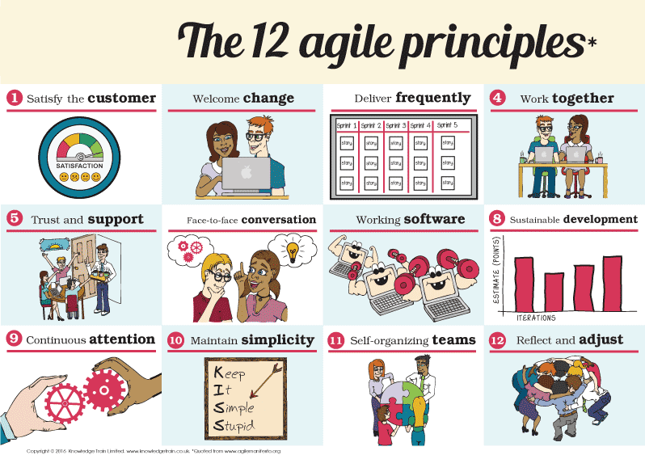

# Resources Final Project Week 2

## Agenda

1. Fundamental Web Application concepts I
   - Form validation
   - Error handling
2. What is Agile?
   - Agile philosophy
   - Waterfall vs. Agile

## 1. Fundamental Web Application concepts I

When building web applications, invariably certain challenges come up. How do you make sure users use your application in the right way? And if they're doing it wrongly, how can we help them to do it better?

Some of these challenges have been addressed by developers, and this has led to certain standard practices we need to learn to incorporate in our applications.

### Form validation

Form validation refers to process of checking the `<input>` fields of a `<form>`, to make sure the user has inserted the correct type of information.

If a user fills in a phone number in an email address input field, we don't want our database to accept it. As you can imagine, this might lead to future trouble.

We can add validation rules to **both the backend and the frontend**. Of the two, the backend validation is most important. Why? Mainly because a hacker cannot access the backend of an application as easily as the frontend.

Learn more about form validation in the following resources:

- [Process and Validate User Submitted Data with Express and Node.js](https://www.youtube.com/watch?v=WFHzlExDwrY)
- [JavaScript Form Validation](https://www.youtube.com/watch?v=In0nB0ABaUk)

### Error handling

An `error`, also known as an `exception`, is a mistake that might happen during the execution of our code. Whenever an error happens, we want to be sure that we know about it. The mechanism by which we learn about the occurrence of an error is called `error handling`.

Imagine an application that had no error handling mechanism at all. How would you know where to look if an error did happen?

In order to know where errors happen we have to `throw` them in certain places of our application. This will help you identify where the error originated. Depending on where you insert it, your program will `catch` this error. This is where you can actually "handle" the error, for example by sending back a response to the client that includes an error message for the user.

Learn more about error handling in the following resources:

- [How to Handle Errors - Basics of Error Handling in JavaScript](https://www.youtube.com/watch?v=G8Jux_bsIXU)
- [try, catch, finally, throw - error handling in JavaScript](https://www.youtube.com/watch?v=cFTFtuEQ-10)

## 2. What is Agile?

In this module you'll learn all about Agile software development, because nowadays that's the standard way of working in modern tech companies. But what is it?

### Agile philosophy

The first thing to learn is that Agile is not a technology. In fact, it has little to do with actual programming.

Instead, it's a **theory for working** that applies to software development projects. When people refer to "Agile working", they are talking about working with certain principles in mind:

This means that it's more about communication and teamwork, within in a business setting. How should the product development process go? How do you relate to your colleagues? These questions and more are answered by the Agile philosophy.

Go through the following to learn more about the Agile philosophy:

- [Software Development Methodology: What is Agile?](https://www.youtube.com/watch?v=GzzkpAOxHXs)
- [Agile manifesto](https://www.youtube.com/watch?v=jSayJF0epJs)

### Waterfall vs. Agile

Like you learned last week, Agile is just one of many software development methodologies. Another important one to know about is called `Waterfall`.

Waterfall is defined by a linear sequence of events, that doesn't taking changing conditions in the software marketplace into consideration.

In a Waterfall development project, each of event represents a distinct stage of software development. One stage, generally speaking, can only start when the previous one has finished. There is also typically a reviewal between each stage, whereby the customer will come in and give their approval.

As a professional software developer you should be aware of both of these models. One isn't "better" than the other, just like one framework (like Vue.js) isn't better than another (like React.js). Instead, they're both just tools to do a different kind of job with.

Learn more about both in the following resources:

- [Software Development Methodology: What is Waterfall?](https://www.youtube.com/watch?v=LxEmGNgqYJA)
- [Waterfall vs. Agile](https://www.youtube.com/watch?v=egF9-FejbsA)
