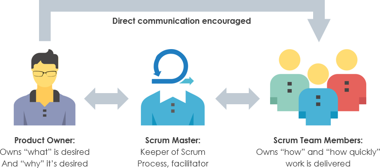

# Resources Final Project Week 3

## Agenda

1. Fundamental Web Application concepts II
   - Authentication vs. authorization
   - Cookies & sessions
2. What is Scrum?
   - Roles
   - Events/Ceremonies
   - Artifacts

## 1. Fundamental Web Application concepts II

When building web applications, invariably certain challenges come up. How do you make sure the application can identify the user, and give them certain priviliges and special access to parts of the website? Or how can you make sure you distinguish one user from another and make sure that they can get back to what they were doing if they accidentally closed the window?

### Authentication vs. authorization

Imagine going to a party with a friend. You arrive at the front door, with your ticket in hand, hoping to get in. You and your friend show your ticket. The doorman checks both tickets and verifies that they are real. You both may enter! However, before you go the doorman mentions that your ticket is actually a VIP ticket. This grants you access to the special backstage area, where you can hang around with all the special cool people. Lucky you!

This little story illustrates the concepts of `authentication` and `authorization`. Let's look at them separately.

`Authentication` is the process of verifying your identity. We do this by checking to see if your data exists in the database, or in the party metaphor, if your ticket is real.

`Authorization` is the process of verifying your privileges. We do this after verifying who you are and looking in the database what you are allowed to do. In the party metaphor this is you, who has a VIP ticket, allowing you access to the backstage area (but not your friend).

Both authentication and authorization are important concepts in web development, because they allow us to build applications that shows different content to different types of users!

Learn more about these concepts in the following resources:

- [Authentication on the web](https://www.youtube.com/watch?v=2PPSXonhIck)

### Cookies & sessions

- [What Are Cookies? And How They Work](https://www.youtube.com/watch?v=rdVPflECed8)
- [How Sessions work in Web Servers](https://www.youtube.com/watch?v=5beyFcuTw20)
- [Difference between cookies, session and tokens](https://www.youtube.com/watch?v=44c1t_cKylo)

## 2. What is Scrum?

Scrum is a practical framework used to define how a team should work when dealing with complex adaptive problems. It's one **practical approach** to applying the Agile philosophy.

As one student described it: Scrum is to Agile, what React.js is to JavaScript.

- [Scrum definition](https://www.scrumguides.org/scrum-guide.html#definition)
- [What is Scrum? (and how does it work)](https://www.youtube.com/watch?v=tNFIpNvyXPw)

### Roles

Within Scrum, a couple of roles are identified. These are the following: Product Owner, Scrum Master and Development Team. Together, they are the Scrum Team (also known as the Product Team).

Go through the following to learn more:

- [Scrum Foundations: Scrum Teams](https://www.youtube.com/watch?v=u79T3wJ6RpY&list=PLjajHmo2Vlp1MgP1AMFTOunMiMGjgLsVC&index=3)
- [Scrum Foundations: Cross Functional Self Organizing Teams](https://www.youtube.com/watch?v=jPfHpYHaUUk&list=PLjajHmo2Vlp1MgP1AMFTOunMiMGjgLsVC&index=4)
- [Scrum Foundations: Scrum Roles](https://www.youtube.com/watch?v=c3lI1zp8hqI&list=PLjajHmo2Vlp1MgP1AMFTOunMiMGjgLsVC&index=5)

### Events/Ceremonies

There are several meetings that are regarded as special, within the Scrum framework.

- [Scrum Foundations: Scrum Events](https://www.youtube.com/watch?v=bWuDyU3SaEo&list=PLjajHmo2Vlp1MgP1AMFTOunMiMGjgLsVC&index=6)
- [Scrum Foundations: Sprint Planning](https://www.youtube.com/watch?v=jy6DzOWaKp4&list=PLjajHmo2Vlp1MgP1AMFTOunMiMGjgLsVC&index=7)
- [Scrum Foundations: Daily Scrum](https://www.youtube.com/watch?v=KC3zqckn6pw&list=PLjajHmo2Vlp1MgP1AMFTOunMiMGjgLsVC&index=8)
- [Scrum Foundations: Sprint Review](https://www.youtube.com/watch?v=sfRNG7AZkuI&list=PLjajHmo2Vlp1MgP1AMFTOunMiMGjgLsVC&index=9)
- [Scrum Foundations: Sprint Retrospective](https://www.youtube.com/watch?v=gxuRYcCwxeI&list=PLjajHmo2Vlp1MgP1AMFTOunMiMGjgLsVC&index=10)

### Artifacts
