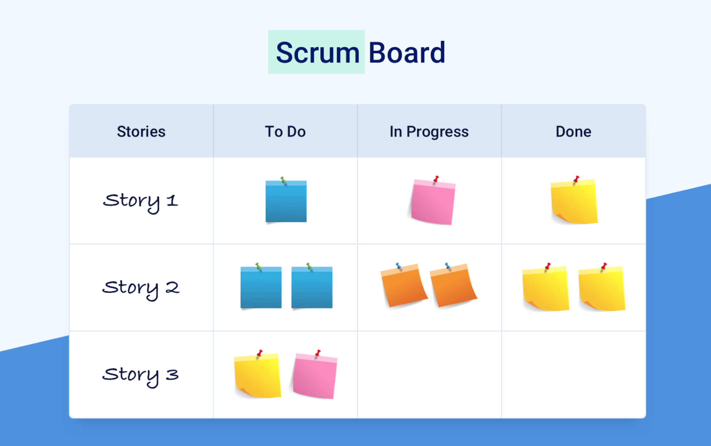

# Resources Final Project Week 4

## Agenda

1. Fundamental Web Application concepts IV
   - Why use GIT
   - GIT usage
   - GIT branches
   - Working with GIT in a team
2. Scrum practices
   - Scrum board
   - Daily standup

## 1. Fundamental Web Application concepts IV

When building web applications, invariably certain challenges come up. Working in a team requires everyone to access the same codebase, but how to do so in a safe and reliable way?

### Why use GIT

Before you delve into the teamworking aspect of using GIT, let's refresh why we even need it. It's always important to know why you're using a tool before you decide to use it.

Roughly speaking, GIT provides us 2 main benefits:

1. **Keep track of files**
   - Save our progress so that we can return to it when we want
   - Restore state of codebase to a previous commit that worked if things went wrong
2. **Enabling teamwork**
   - Provide a tool to “push” your code to a place (like GitHub) other people can
     easily reach, by “pulling” it.


### GIT usage

GIT can be used in 3 different ways:

1. **Using the command line.** Inserting commands like `git status` and `git push origin master`, allows you to easily use GIT to perform your operations.
2. **Using the code editor.** Some code editors, like Visual Studio Code, have a source control functionality added internally. This way you can easily perform basic GIT operations, without the need for using commands
3. **Using a Graphical User Interface (GUI).** Some people prefer a visual representation of GIT usage. For these people there are several options available. Recommended are [GIT Kraken](https://www.gitkraken.com/) and (SourceTree)(https://www.sourcetreeapp.com/).

In the end it doesn't matter that much which way you go. As long as you can work with it easily and it improves your ability to work in a team; it's up to you to decide which you prefer!

### GIT branches

Before we go into the teamwork part of using GIT, let's discuss GIT branches first.

Here's a simple definition of a `GIT branch`: another version of our codebase, that we can use to experiment with (ex. developing/removing features, refactoring, etc.)

We create a new branch by `git checkout` to a branch that we want to branch off from (so that they will be connected). Then we create a new branch by using `git branch [BRANCH_NAME]`.

Learn more about that here:

- [GIT: Working with Branches](https://www.youtube.com/watch?v=JTE2Fn_sCZs)

### Working with GIT in a team

Working with GIT in a team is a daily occurrence for any software developer. Everyone works from the same codebase, found in the same repository. Each developer **clones** this repository to their local machine and can then get started.

- [GITHUB PULL REQUEST, Branching, Merging & Team Workflow](https://www.youtube.com/watch?v=oFYyTZwMyAg)

## 2. Scrum practices

Starting this week you'll work extensively within the Scrum framework. As you've learned in previous weeks, Scrum consists of 3 major components: `roles`, `events/ceremonies` and `artifacts`. In this section we'll highlight one tool (the Scrum Board) and one Scrum event (the Daily Standup), as you'll be dealing with them almost daily at your job.

### Scrum board

The Scrum board is a visual representation of the Scrum process. Here's an example:



In your project you'll use [Github Project Boards](https://docs.github.com/en/github/managing-your-work-on-github/about-project-boards) for this purpose, though in reality you could use almost any tool: [Trello](https://www.youtube.com/watch?v=tVooja0Ta5I), [Jira](https://www.youtube.com/watch?v=xrCJv0fTyR8), or even a good old whiteboard and some sticky notes.

The Product Owner manages the board, though you as the software developer needs to keep it up to date as well. What exactly do you need to keep up to date? The issues (also known as tickets or cards) and their progress.

Learn more here:

- [What is a Scrum Board?](https://www.youtube.com/watch?v=Rdl9_X3IOuE)

### Daily standup

The Daily Standup (also known as the Daily Scrum) is a daily meeting, where the complete Development Team comes together to synchronize with each other. In this short meeting, of usually only 15 minutes total, every software developer literally "stands up" from their desk and stands with the team in a circle

The point of the Daily Standup is for each person to answer the following three questions:

```md
3 QUESTIONS

1. What did I do yesterday?
2. What will I do today?
3. Do I have any obstacles that I could use support with?
```

This meeting is **NOT** meant to be a platform for discussion. If there is anything that needs to be discussed, this will be done outside of Daily Standup.

Learn more about the Daily Standup here:

- [Daily Stand-up Meeting](https://www.youtube.com/watch?v=GzQjGhD5tSU)
- [What is a Daily Scrum](https://www.scrum.org/resources/what-is-a-daily-scrum)
